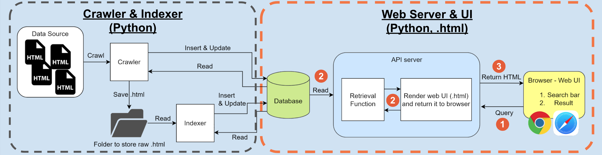

# System Overview

Basic components of web-based search engine
* **Crawler**: to fetch the pages recursively with breadth-first strategy
* **Indexer**: to store information as collated by crawler
* **Retrieval function and query handling**: to compile similarity between query term and documents stored, then return relevant documents



1. User sends a query request from browser to server
2. Server processes the query, retrieves related pages from database, renders .html
3. Server returns .html back to browser
4. Browser gets .html and shows up the search results 

## Indexer with 

# Demo Video

https://www.youtube.com/watch?v=ZTa8D6w3hbg

https://user-images.githubusercontent.com/71545537/234554295-e2409013-5377-4894-bd97-d1557fc85ec0.mp4

# Local Setup for running

Please use Python 3.9.

## (1) Crawler and Indexer

To run in Linux:
```shell
$ pwd
/xxxx/learn-search-engine-result-template

$ pip install -r requirements.txt

$ python crawler.py
$ python indexer.py
```


## (2) Search Engine - Web interface
1. Current path:
    ```shell
    $ pwd
    /xxxx/learn-search-engine-result-template
    
    $ ls
    README.md               app                     pyproject.toml          run.sh                  stopwords.txt
    alembic.ini             poetry.lock             requirements.txt        sample_data             venv
    ```
2. Go to the directory where the `pyproject.toml` is located then `poetry install`
3. [UNIX]: Run the FastAPI server via poetry with the bash script: `poetry run ./run.sh`
4. [WINDOWS]: Run the FastAPI server via poetry with the Python command: `poetry run run.sh`
5. Open http://localhost:8001/
6. Add `SENT_SEARCH: {text-to-query}` to the query in search bar if you want to levage the power of Sentence Transformer, otherwise makes the query `{text-to-query}` only to use the normal-version keyword search.

To stop the server, press CTRL+C
